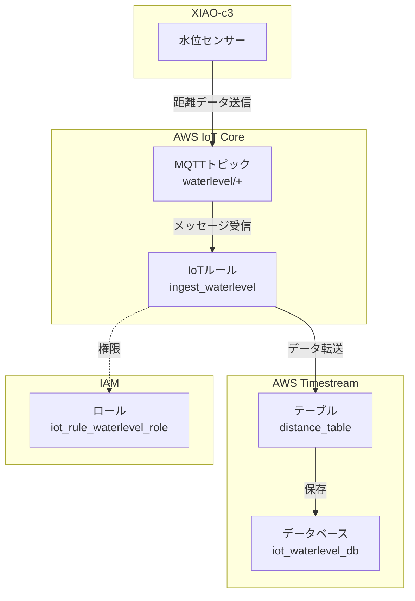

# IoT稲作水位監視システムクラウド環境

AWS IoT CoreとTimestreamを使用した稲作水位監視システムのインフラストラクチャ
立ち上げ専用なのでがばがばです


## アーキテクチャ



## 構成要素

### 1. Timestream Database
- **名前**: `iot_waterlevel_db`
- **用途**: 時系列データの保存

### 2. Timestream Table
- **名前**: `distance_table`
- **データ**: デバイスID、フィールドID、距離値、タイムスタンプ

### 3. IoT Core Rule
- **名前**: `ingest_waterlevel`
- **トピック**: `waterlevel/+`
- **機能**: 自動データ転送

### 4. IAM Role
- **名前**: `iot_rule_waterlevel_role`
- **権限**: Timestream書き込み権限

## データフロー

1. **センサー測定** → 水位センサーが距離を測定
2. **MQTT送信** → `waterlevel/{deviceId}` トピックに送信
3. **ルール処理** → IoTルールがメッセージを処理
4. **データ保存** → Timestreamに時系列データとして保存

## デプロイ方法

### 前提条件
- AWS CLI設定済み
- Terraform 1.5.7以上

### 手順
```bash
# ディレクトリ移動
cd terraform

# 初期化
terraform init

# 計画確認
terraform plan

# デプロイ
terraform apply
```

### 設定変更
`main.tf`の12行目でリージョンを変更可能：
```hcl
provider "aws" {
  region = "us-east-1" # ★必要に応じて変更
}
```

## 出力値

デプロイ後に以下の値が出力されます：
- `timestream_database`: データベース名
- `timestream_table`: テーブル名
- `iot_rule_name`: IoTルール名

## 用途例

- **農業**: 水田の水位監視


## 技術仕様

- **Terraform**: >= 1.5.7
- **AWS Provider**: >= 5.0
- **リージョン**: us-east-1（デフォルト）
- **SQLバージョン**: 2016-03-23

## ライセンス

MIT License
